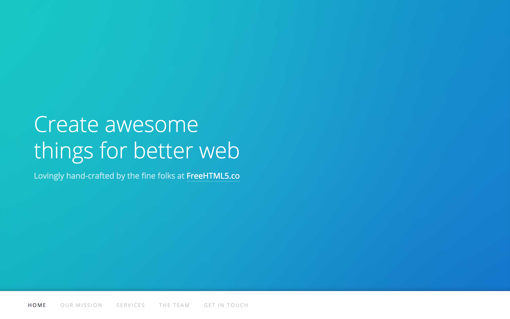

# Icon Theme

This theme is based on the icon theme by [https://freehtml5.co/](https://freehtml5.co/faq/). It is a single-page, responsive theme, with sections for describing your business mission, services, a gallery, your team and a contact form.



## Installation

Follow the themes guide on the [Hugo website](https://gohugo.io/themes/installing-and-using-themes/). Briefly, within your Hugo folder:

```sh
$ cd themes
$ git clone https://github.com/SteveLane/hugo-icon.git
```

## Getting started
